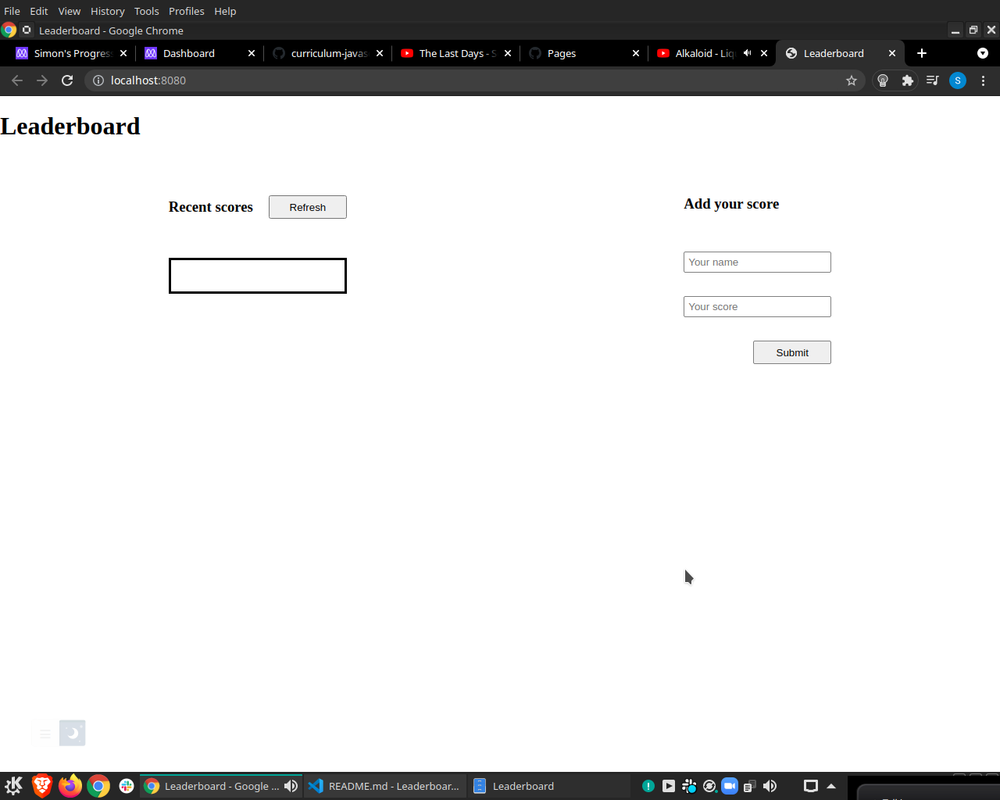

# Leaderboard

> This project is simple Leaderboard:

  - Add new score
  - Remove all scores
  - ( on the next milestone It will fetch data from API)

Additional description about the project and its features.

## Built With
    HTML
    CSS
    JS

## Live Demo

[Live Demo Link](https://flamboyant-khorana-e25906.netlify.app)

## Getting Started

### Prerequisites
  **webpack**,
  **HtmlWebpackPlugin**,
  **style-loader css-loader**,
  **webpack-dev-server**

## Setup

#### $git clone https://github.com/SimonGrchevski/Leaderboard.git
#### $cd Leaderboard
#### $npm install
#### $npm run start

## Authors

👤 **Author1**

- GitHub: [Github](https://github.com/SimonGrchevski)
- LinkedIn: [LinkedIn](https://www.linkedin.com/in/simon-grchevski-682935209/)
- Twitter: [Twitter](https://twitter.com/grchevski)

## 🤝 Contributing

Contributions, issues, and feature requests are welcome!

Feel free to check the [issues page](../../issues/).

## Show your support

Give a ⭐️ if you like this project!

## Acknowledgments

- Hat tip to anyone whose code was used
- Inspiration
- etc

## 📝 License

This project is [MIT](./MIT.md) licensed.

